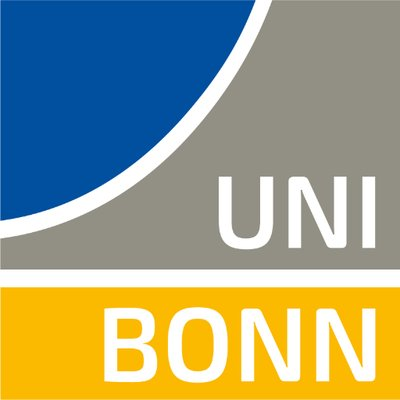

# Welcome to Chenyu Zhang's Page

CHENYU ZHANG  
M.S.E. in Robotics  
Johns Hopkins University  
email: <czhan129@jhu.edu>

I am a second year M.S. student of [the M.S.E. program in Robotics](https://lcsr.jhu.edu/MSE/) in [the Laboratory for Computational Sensing and Robotics (LCSR)](https://lcsr.jhu.edu/), [Johns Hopkins University](https://www.jhu.edu//). 

In my undergraduate time, I joined [Prof.Cunjun Ruan](http://www.ee.buaa.edu.cn/info/1129/17618.htm)'s lab in 2017, conducting research in the field of **vacuum electronic devices**. In 2018 summer, I joined [Prof.Chun Zhang](https://www.tsinghua.edu.cn/publish/ime/5910/2015/20150315131055824979933/20150315131055824979933_.html)'s lab in [Institute of Microelectronics](https://www.tsinghua.edu.cn/publish/imeen/5943/index.html), [Tsinghua University](https://www.tsinghua.edu.cn/publish/thu2018en/index.html), working on **improved k-means clustering algorithms and robotics**. In 2019 summer, I visited [National University of Singapore](http://www.nus.edu.sg/) and collaborated with [Prof.Loh Ai Poh](https://www.eng.nus.edu.sg/idp/staff/lohaipoh/) on **physical modeling and simulation in robotics**. In 2020 summer, I joined [Momenta](https://www.momenta.cn/) as an R&D intern and focusing on **SLAM algorithm and HD Map**. In 2021 fall, I joined [CCVL lab](https://ccvl.jhu.edu/) lead by [Prof. Alan Yuille](https://www.cs.jhu.edu/~ayuille/), working on **visual question answering (VQA) models**. In 2022 summer, I interned at [Bonn University](https://www.uni-bonn.de/en/university/university) under the supervision of [Prof. Jürgen Gall](https://pages.iai.uni-bonn.de/gall_juergen/), working on **semantic scene completion for LiDAR point cloud**. The current project I am working on at CCVL is **scene graph generation** utilizing a unified multimodal Transformer framework.

My research interests include computer vision, widely on machine learning and multimodal deep learning. I firmly believe that huge contributions could be made with interdisciplinary among these fields to benefit the world.

 

# Education

 
  
 
 
 <b> Johns Hopkins University </b>    
 <i> M.S.E. Program in Robotics，Jan. 2021 - now </i>
 

  

   
 
 
  
 <b> Beihang University </b>  
  School of Electronic and Information Engineering   
 <i> Bachelor of Engineering, Sep. 2016 - Jul. 2020 </i> 
 

 
  
 
 
  
 
 
 <b> National University of Singapore </b>    
 <i> Visiting Student, Jul. 2019 - Sep. 2019 </i>
 

   
 
 
  
 
 
 <b> Rheinische Friedrich-Wilhelms-Universität Bonn </b>    
 <i> Visiting Student, Jun. 2022 - Aug. 2022 </i>
 

 
 
# Industry Experience
   
 
 
   
<b> Momenta </b>    
 <i> R&D Intern，Aug. 2020 - Jan. 2021 </i> 
 

 
 

# Publications

[1] <b>Chenyu Zhang</b>, Zhuowan Li, Alan Yuille. “Seq2Seq Scene Graph Generation Utilizing Vision-language Pretrained Model”, IEEE/CVF Conference on Computer Vision and Pattern Recognition (CVPR 2023), plan to submit.

[2] Vipul Gupta, Adam Kortylewski, Zhuowan Li, <b>Chenyu Zhang</b>, Yingwei Li, Alan Yuille. “[SwapMix: Diagnosing and Regularizing the Over-Reliance on Visual Context in Visual Question Answering](https://openaccess.thecvf.com/content/CVPR2022/papers/Gupta_SwapMix_Diagnosing_and_Regularizing_the_Over-Reliance_on_Visual_Context_in_CVPR_2022_paper.pdf)”, <i>IEEE/CVF Conference on Computer Vision and Pattern Recognition (CVPR 2022)</i>, accepted.

 
 
# Honors

* *2021* &nbsp;  the LCSR Distinguished Scholarship
* *2020* &nbsp;  University **Outstanding Undergraduate Student**
* *2019* &nbsp;  Yuanhang Undergraduate Summer Overseas Research Scholarship
* *2019* &nbsp;  Third Prize of Innovation and Entrepreneurship Scholarship by Ministry of Industrialization and Information Technology
* *2018* &nbsp;  **PI** of National Undergraduate Training & Research Program for Innovation and Entrepreneurship, evaluated **Excellent Project**
* *2018* &nbsp;  **Outstanding Award** of University Academic Scholarship (top 3%)
* *2018* &nbsp;  **First Prize** of CUPT (China Undergraduate Physics Tournament) in North China Division, as the **Captain** of the Team Ⅱ
* *2017* &nbsp;  **First Prize** of the Physics Competition at university
* *2017* &nbsp;  **Outstanding** Scholarship (top 5%)
* *2017* &nbsp;  **First Prize** of University Outstanding Study Scholarship (top 5%)
* *2017* &nbsp;  Competitive-world Scholarship (top 1%)

