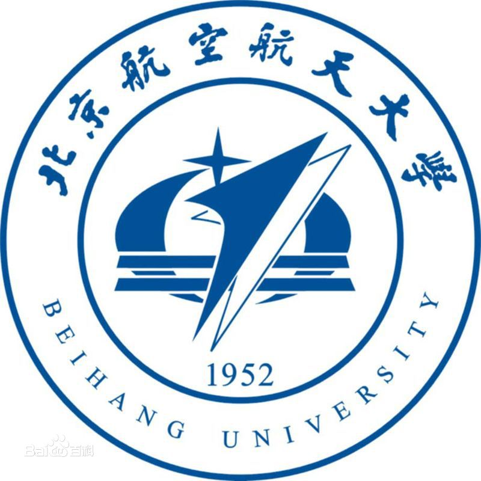

# Welcome to Chenyu Zhang's Page

CHENYU ZHANG  
Whiting School of Engineering  
Johns Hopkins University  
email: <czhan129@jhu.edu>

I am an incoming dergraduate student major in Robotics M.S.E. in [the Whiting School of Engineering](https://engineering.jhu.edu/), [Johns Hopkins University](https://www.jhu.edu/). 

Before entering JHU, I joined Prof.[Cunjun Ruan](http://www.ee.buaa.edu.cn/info/1129/17618.htm)'s lab in 2017, conducting research in the field of **vacuum electronic devices**. In 2018 summer, I joined Prof.[Chun Zhang](https://www.tsinghua.edu.cn/publish/ime/5910/2015/20150315131055824979933/20150315131055824979933_.html)'s lab in [Institute of Microelectronics](https://www.tsinghua.edu.cn/publish/imeen/5943/index.html), [Tsinghua University](https://www.tsinghua.edu.cn/publish/thu2018en/index.html), working in the field of **image-processing algorithms and robotics**. In 2019 summer, I visited [National University of Singapore](http://www.nus.edu.sg/)  and collaborated with Prof.[Loh Ai Poh](https://www.eng.nus.edu.sg/idp/staff/lohaipoh/) in the field of **robotics**.

My research interests include robotics, widely on machine learning, computer vision and large scale data analytics. I firmly believe that huge contributions could be made in researching these fields.

 
# Resume

Here is my [CV](./CV_Chenyu Zhang.pdf).
  
# Education

 
 
  
 
 
 <b> Johns Hopkins University </b>    
 <i> Master of Science in Engineering </i>
 

 

   
 
 
  
 <b> Beihang University </b>  
  School of Electronic and Information Engineering   
 <i> Bachelor of Engineering, Sep. 2016 - Jul. 2020 (Expected) </i> 
 

 
  
 
 
  
 
 
 <b> National University of Singapore </b>    
 <i> Visiting Student, Jul. 2019 - Sep. 2019 </i>
 

 
 

# Publication

[1] <b>Chenyu Zhang</b> and Chun Zhang. “Application of Improved K-means Algorithm in Multi-track Clustering”, submitted to <i>IEEE International conference on Image Processing</i> (ICIP 2021).

[2] Zheng Zhang, Cunjun Ruan, <b>Chenyu Zhang</b>, Ayesha Kosar Fahad, Yiyang Su, Pengpeng Wang, Wenlong He, “Multiple Beam and Double-mode Staggered Double Vane Travelling Wave Tube with Ultra-wide Band”, submitted to <i>Scientific Reports</i>.

[3]Zhonghan Zhang, Yancao Jiang, <b>Chenyu Zhang</b>, Chun Zhang, and Xiangyu Li. “The Optimization of Localization and Navigation for Vision-Based Robot”, accepted for lecture presentation by <i>IEEE International Conference on Integrated Circuits, Technologies and Applications</i> (ICTA 2019), full paper in press.

[4] <b>Chenyu Zhang</b>, Cunjun Ruan, “Investigation of W-band High Power TWT Amplifier with Broadband Output Window”. accepted by <i>PhotonIcs & Electromagnetics Research Symposium</i> (PIERS 2019), full paper in press.  

[5] Renjie Li, Cunjun Ruan, Ayesha Fahad, <b>Chenyu Zhang</b>, and Shasha Li. “[Broadband and high-power terahertz radiation source based on extended interaction klystron](https://www.nature.com/articles/s41598-019-41087-3)”, *Scientific Reports*, issue 9, no. 4584, Mar. 2019.

 
 
# Honors

* *2020* &nbsp;  **Outstanding graduate** in BUAA
* *2019* &nbsp;  Yuanhang Undergraduate Summer Overseas Research Scholarship
* *2019* &nbsp; Third Prize in Class B of Innovation and Entrepreneurship Scholarship by Ministry of Industrialization Information
* *2018*  &nbsp; **Excellent Ranking** of National Undergraduate Training Program for Innovation and Entrepreneurship
* *2018* &nbsp;  **Special Award** of Academic Scholarship (top 3%)
* *2018*  &nbsp; **First Prize** of CUPT (China Undergraduate Physics Tournament) in North China Division, as the **Captain** of the Beihang Team Ⅱ
* *2018* &nbsp;  Honorable Prize of MCM/ICM
* *2017* &nbsp;  **First Prize** of the Physics Competition in Beihang University
* *2017*  &nbsp; **Outstanding** Scholarship (top 5%)
* *2017* &nbsp;  **First Prize** of Outstanding Study Scholarship (top 5%)
* *2017* &nbsp;  Competitive-world Scholarship (top 1%)

