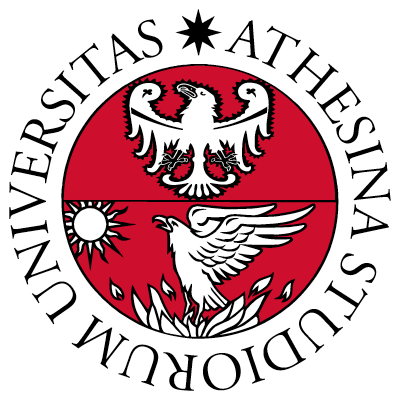

CHENYU ZHANG  
ELLIS PhD student  
<!-- the University of Trento   -->
email: <chenyu.zhang@unitn.it> 
[google scholar](https://scholar.google.com/citations?hl=en&user=mhQQsNgAAAAJ)

I am a first year PhD student of the [ELLIS PhD Program](https://ellis.eu/phd-postdoc), supervised by [Prof. Dr. Nicu Sebe](https://disi.unitn.it/~sebe/) in [MHUG](http://mhug.disi.unitn.it/#/), and 
co-supervised by [Prof. Dr. Max Welling](https://staff.fnwi.uva.nl/m.welling/) in [AMLab](https://amlab.science.uva.nl/). My current research interests are on AI4Science, Science4AI, image generation and physics-based deep learning. Before PhD, I worked with [Prof. Dr. Alan Yuille](https://www.cs.jhu.edu/~ayuille/) in [CCVL](https://ccvl.jhu.edu/) at [Johns Hopkins University](https://www.jhu.edu/), on the topic of visual question answering and scene graph generation. 

 

## Education

 
 
 
 
  
 <b> ELLIS PhD Program </b>    
 <b> University of Trento </b>    
 <i> PhD student in Computer Science </i>  
 <i> Nov. 2023 - Apr. 2027 </i>
 

  

 
 
 
  
 <b> ELLIS PhD Program </b>    
 <b> University of Amsterdam </b>    
 <i> exchange student </i>
 

  

 
 
 
    
 <b> Johns Hopkins University </b>    
 <i> M.S.E. Program in Robotics，Jan. 2021 - Dec. 2022 </i>
 

 

 
 

## Selected Publications

[1] Vipul Gupta, Adam Kortylewski, Zhuowan Li, <b>Chenyu Zhang</b>, Yingwei Li, Alan Yuille. “[SwapMix: Diagnosing and Regularizing the Over-Reliance on Visual Context in Visual Question Answering](https://openaccess.thecvf.com/content/CVPR2022/papers/Gupta_SwapMix_Diagnosing_and_Regularizing_the_Over-Reliance_on_Visual_Context_in_CVPR_2022_paper.pdf)”, <i>IEEE/CVF Conference on Computer Vision and Pattern Recognition (CVPR 2022)</i>.

 

## Academic Services
Reviewer:  
CVPR 2023, 2024.  
ICCV 2023.   
ECCV 2024.   
ACCV 2024.

 

## Selected Honors

* *2021* &nbsp;  the LCSR Distinguished Scholarship, Johns Hopkins University
* *2020* &nbsp;  Excellent Undergraduate Student
* *2018* &nbsp;  First Prize of CUPT (China Undergraduate Physics Tournament) in North China Division, as the Captain of the Team Ⅱ
* *2017* &nbsp;  Competitive-world Scholarship (top 1%)

