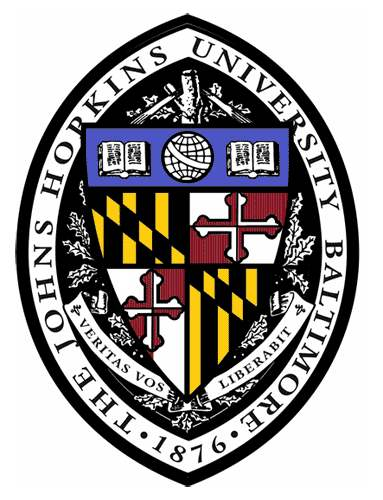

CHENYU ZHANG  
ELLIS PhD student  
<!-- the University of Trento   -->
email: <chenyu.zhang@unitn.it> 
[google scholar](https://scholar.google.com/citations?hl=en&user=mhQQsNgAAAAJ) / [twitter](https://twitter.com/AngelicaCZ2016)

I am a second year PhD student of the [ELLIS PhD Program](https://ellis.eu/phd-postdoc), supervised by [Prof. Nicu Sebe](https://disi.unitn.it/~sebe/) in [MHUG](http://mhug.disi.unitn.it/#/), and 
co-supervised by [Prof. Max Welling](https://staff.fnwi.uva.nl/m.welling/) in [AMLab](https://amlab.science.uva.nl/). My current research interests are on using NN to simulate dynamical systems and physical reasoning in generative models. Before PhD, I worked with [Prof. Alan Yuille](https://www.cs.jhu.edu/~ayuille/) in [CCVL](https://ccvl.jhu.edu/) at [Johns Hopkins University](https://www.jhu.edu/). 

Combining physics with AI is fun. Physics provides the framework for understanding the universe through mathematical models, offering insights into the fundamental laws that govern our world. AI, particularly through deep learning, enhances our ability to make predictions with remarkable accuracy, although often at the expense of interpretability. My works aim to bridge this gap, leveraging the precision of AI and the foundational principles of physics to develop innovative, interpretable models.

 
 

## Selected Publications

[1] <b>Chenyu Zhang</b>&#42;, Daniil Cherniavskii&#42;, Andrii Zadaianchuk&#42; Antonios Tragoudaras&#42;, Antonios Vozikis, Thijmen Nijdam, Derck W. E. Prinzhorn, Mark Bodracska, Nicu Sebe, Efstratios Gavves. "[Morpheus: Benchmarking Physical Reasoning of Video Generative Models with Real Physical Experiments](https://arxiv.org/pdf/2504.02918v1)"

[2] Vipul Gupta, Adam Kortylewski, Zhuowan Li, <b>Chenyu Zhang</b>, Yingwei Li, Alan Yuille. “[SwapMix: Diagnosing and Regularizing the Over-Reliance on Visual Context in Visual Question Answering](https://openaccess.thecvf.com/content/CVPR2022/papers/Gupta_SwapMix_Diagnosing_and_Regularizing_the_Over-Reliance_on_Visual_Context_in_CVPR_2022_paper.pdf)”, <i>IEEE/CVF Conference on Computer Vision and Pattern Recognition (CVPR 2022)</i>.

 

## Academic Services
Reviewer:  
CVPR 2023, 2024, 2025.  
ICCV 2023, 2024, 2025.   
ECCV 2024.   
ACCV 2024.

 

 

## Education

 
 
 
 
  
 <b> ELLIS PhD Program </b>    
 <b> University of Trento </b>    
 <i> PhD student in Computer Science </i>  
 <!-- <i> Nov. 2023 - Apr. 2027 </i> -->
 

  

 
 
 
  
 <b> ELLIS PhD Program </b>    
 <b> University of Amsterdam </b>    
 <i> exchange student </i>
 

  

 
 
 
    
 <b> Johns Hopkins University </b>    
 <i> M.S.E. Program in Robotics</i>
 <!-- ，Jan. 2021 - Dec. 2022  -->
 

 

## Selected Honors

* the LCSR Distinguished Scholarship, Johns Hopkins University
* Excellent Undergraduate Student
* First Prize of CUPT (China Undergraduate Physics Tournament) in North China Division, as the Captain of the Team Ⅱ
* Competitive-world Scholarship (top 1% of University)

